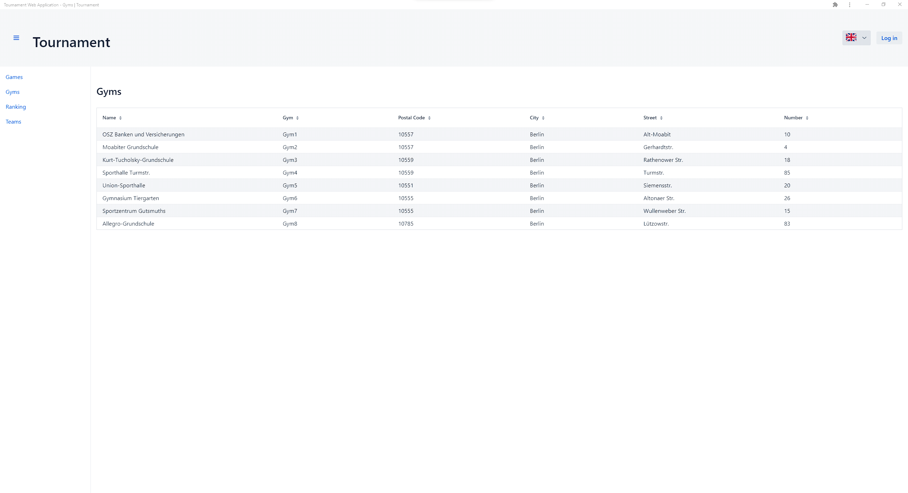
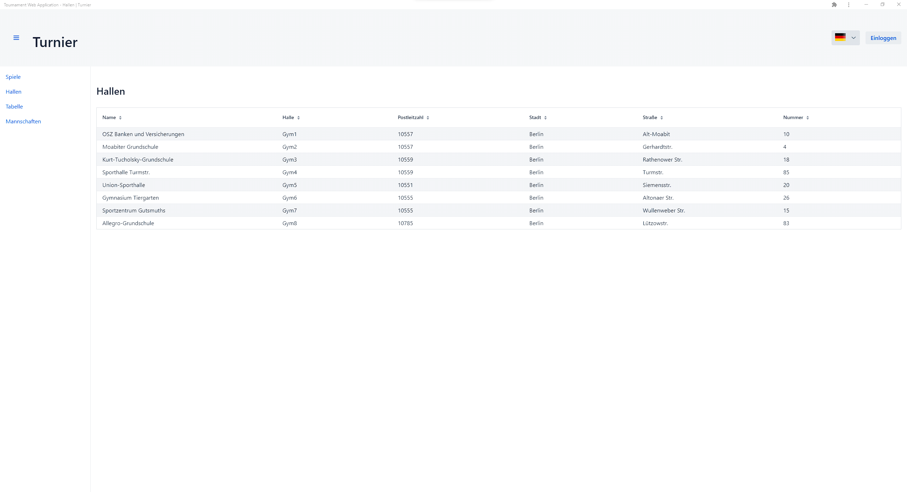
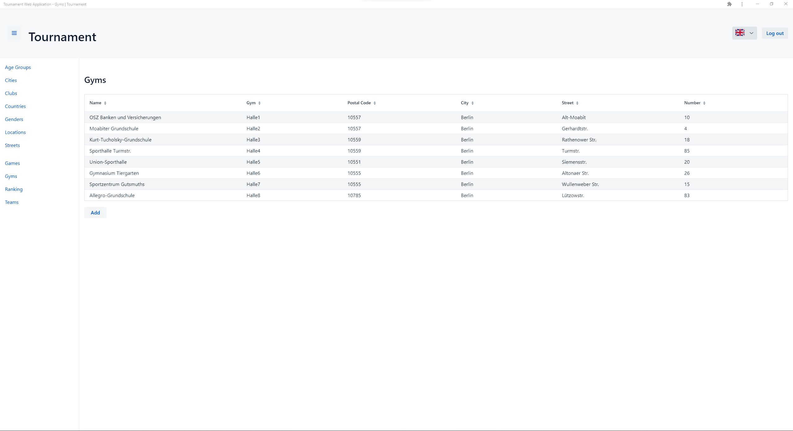

[![Contributors][contributors-shield]][contributors-url]
[![Forks][forks-shield]][forks-url]
[![Stargazers][stars-shield]][stars-url]
[![Issues][issues-shield]][issues-url]
[![MIT License][license-shield]][license-url]

  
<h2 align="center">TournamentWebApplication</h2>
  

    Web Application for displaying a tournament schedule online with a sqlite database in the backend.
  

- [Report Bug](https://github.com/ProfSchmergmann/TournamentWebApplication/issues)
- [Request Feature](https://github.com/ProfSchmergmann/TournamentWebApplication/issues)

---

## Table of Contents

1. [About the Project](#1-about-the-project)
    - [Built With](#built-with)
2. [Getting Started](#2-getting-started)
    - [Prerequisites](#prerequisites)
    - [Installation](#installation)
    - [Deployment](#deployment)
3. [Usage](#3-usage)
4. [Contributing](#4-contributing)
5. [License](#5-license)
6. [Contact](#6-contact)

---

## 1. About The Project

Web Application for displaying a tournament schedule online with a sqlite database in the backend.
It can be used for any kinds of sports and as for right now there are still too few database models.
Basically this is just for planning a tournament and let the participants view their game schedule online.

(<a href="#readme-top">back to top</a>)

### Built With

[![Spring][Spring-Boot]][Spring-Boot-url]

[![Vaadin][Vaadin]][Vaadin-url]

[![Gradle][Gradle]][Gradle-url]

[![Java][Java]][Java-17-url]

[![Checkstyle]][Checkstyle-url]

[![Jib]][Jib-url]

[![Google-Icons]][Google-Icons-url]

(<a href="#readme-top">back to top</a>)

---

## 2. Getting Started

To get a local copy up and running follow these simple example steps.

### Prerequisites

1. Download and install [Intellij Idea](https://www.jetbrains.com/de-de/idea/)
2. Clone the project with `git clone https://github.com/ProfSchmergmann/TournamentWebApplication.git`
3. Let Intellij do its magic e.g.
    - Indexing module
    - Installing gradle
    - Indexing gradle
    - Downloading packages
4. Download and link [Java 17](https://docs.aws.amazon.com/corretto/latest/corretto-17-ug/downloads-list.html)
5. You are now set to contribute, commit, have fun with this project.

### Installation

There is no real installation because this is a Spring-Boot and Vaadin Web-Application but you can run the application
using the task `bootRun` from gradle if you are ***NOT*** in production mode (you can see this setting inside the `vaadin`
tag inside the [build.gradle](build.gradle) file). Otherwise, you have to run `vaadinBuildFrontend` first before you can
execute the `bootRun` task.

### Deployment

If you want to deploy the jar you just need to execute the task `bootJar`.

#### TODO: Deploying inside a docker container.

(<a href="#readme-top">back to top</a>)

---

## 3. Usage

This is a screenshot of the page showing the tournament gyms with some example values.
As you can see there is a menu on the left-hand side where you can also choose other values to be displayed inside the
middle of this page.

This screenshot is nearly the same one as the above one with the difference that the user chose german as language.
You can see that there is also a support for choosing between english and german as display language.

Again this screenshot is nearly the same as the two above except from the logged in status of the current user.
As you can see by the button in the upper right corner the current user is logged in as an admin or superuser (roles not
implemented yet) with the privilege that he can now see the "Add" button and is also able to delete values.

(<a href="#readme-top">back to top</a>)

---

## 4. Contributing

Contributions are what make the open source community such an amazing place to learn, inspire, and create. Any
contributions you make are **greatly appreciated**.

If you have a suggestion that would make this better, please fork the repo and create a pull request. You can also
simply open an issue with the tag "enhancement".
Don't forget to give the project a star! Thanks again!

1. Fork the Project
2. Create your Feature Branch (`git checkout -b feature/AmazingFeature`)
3. Commit your Changes (`git commit -m 'Add some AmazingFeature'`)
4. Push to the Branch (`git push origin feature/AmazingFeature`)
5. Open a Pull Request

(<a href="#readme-top">back to top</a>)

---

## 5. License

Distributed under the MIT License. See [LICENSE](LICENSE) for more information.

(<a href="#readme-top">back to top</a>)

---

## 6. Contact

Sven Bergmann - sven.bergmann@rwth-aachen.de

Project
Link: [https://github.com/ProfSchmergmann/TournamentWebApplication/](https://github.com/ProfSchmergmann/TournamentWebApplication/)

(<a href="#readme-top">back to top</a>)

[contributors-shield]: https://img.shields.io/github/contributors/ProfSchmergmann/TournamentWebApplication.svg

[contributors-url]: https://github.com/ProfSchmergmann/TournamentWebApplication/graphs/contributors

[forks-shield]: https://img.shields.io/github/contributors/ProfSchmergmann/TournamentWebApplication.svg

[forks-url]: https://github.com/ProfSchmergmann/TournamentWebApplication/network/members

[stars-shield]: https://img.shields.io/github/stars/ProfSchmergmann/TournamentWebApplication.svg

[stars-url]: https://github.com/ProfSchmergmann/TournamentWebApplication/stargazers

[issues-shield]: https://img.shields.io/github/issues/ProfSchmergmann/TournamentWebApplication.svg

[issues-url]: https://github.com/ProfSchmergmann/TournamentWebApplication/issues

[license-shield]: https://img.shields.io/github/license/ProfSchmergmann/TournamentWebApplication.svg

[license-url]: https://github.com/ProfSchmergmann/TournamentWebApplication/blob/master/LICENSE

[linkedin-shield]: https://img.shields.io/badge/-LinkedIn-black.svg?style=for-the-badge&logo=linkedin&colorB=555

[linkedin-url]: https://www.linkedin.com/in/sven-bergmann-500925227/

[Spring-Boot]: https://img.shields.io/badge/SpringBoot-v2.7.2-6DB33F?&logo=springboot&logoColor=white

[Spring-Boot-url]: https://spring.io/projects/spring-boot

[Vaadin]: https://img.shields.io/badge/Vaadin-v23.1.3-00B4F0?&logo=vaadin&logoColor=white

[Vaadin-url]: https://vaadin.com/

[Gradle]: https://img.shields.io/badge/Gradle-v7-02303A?&logo=gradle&logoColor=white

[Gradle-url]: https://services.gradle.org/distributions/

[Java]: https://img.shields.io/badge/Java-v17-ED8B00?logo=java&logoColor=white

[Java-17-url]: https://docs.aws.amazon.com/corretto/latest/corretto-17-ug/downloads-list.html

[Checkstyle]: https://img.shields.io/badge/Checkstyle-v10.3.2-red?logoColor=white

[Checkstyle-url]: https://checkstyle.sourceforge.io/releasenotes.html

[Jib]: https://img.shields.io/badge/Jib-v3.2.1-orange?logo=jib&logoColor=white

[Jib-url]: https://github.com/GoogleContainerTools/jib/tree/master/jib-gradle-plugin

[Google-Icons]: https://img.shields.io/badge/Google_Icons--yellow?logo=google&logoColor=white

[Google-Icons-url]: https://fonts.google.com/icons